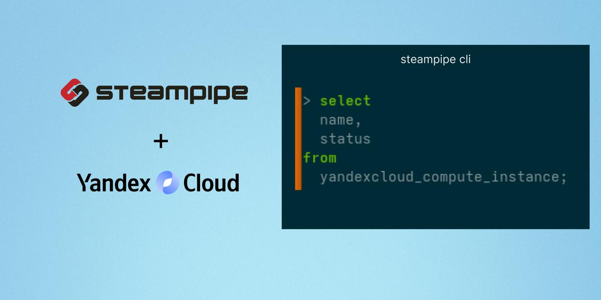

[](https://goreportcard.com/report/github.com/dev404ai/steampipe-plugin-yandexcloud)


[](https://github.com/dev404ai/steampipe-plugin-yandexcloud/pulls)


# Yandex Cloud Plugin for Steampipe

The Yandex Cloud Plugin for Steampipe enables you to query and analyze your Yandex Cloud resources using SQL. With this plugin, you can audit infrastructure, monitor resources, and create dashboards by joining, filtering, and aggregating cloud data in real time. It supports Compute, Storage, Billing, IAM, and more, making cloud management and compliance easy and efficient.

## Quick Start

1. **Install Steampipe:**
   [Download and install Steampipe](https://steampipe.io/downloads) for your platform.

2. **Install the Yandex Cloud plugin:**
   ```sh
   steampipe plugin install dev404ai/yandexcloud
   ```

3. **Configure your Yandex Cloud credentials:**
   Create or edit the file `~/.steampipe/config/yandexcloud.spc` with your service account key file, cloud ID, and folder ID. Example:
   ```hcl
   connection "yandexcloud" {
     plugin      = "yandexcloud"
     service_account_key_file = "<YOUR_SERVICE_ACCOUNT_KEY_FILE>"
     cloud_id    = "<YOUR_CLOUD_ID>"
     folder_id   = "<YOUR_FOLDER_ID>"
   }
   ```

# Add instructions for creating service_account_key_file

## How to Create a Yandex Cloud Service Account Key File

To use this plugin, you need a service account key file (JSON) with sufficient permissions. Follow these steps:

1. **Create a Service Account:**
   - Go to the [Yandex Cloud Console](https://console.cloud.yandex.com/).
   - Select your cloud and folder.
   - Open the "Service accounts" section and click "Create service account".

2. **Assign Roles:**
   - After creating the service account, assign it the necessary roles (e.g., `editor`, `viewer`, or more specific roles depending on your use case).

3. **Create a Key for the Service Account:**
   - In the service account details, go to the "Keys" tab.
   - Click "Create new key" and select "Authorized key" (JSON).
   - Download the generated JSON file. This is your `service_account_key_file`.

4. **Use the Key File in Steampipe:**
   - Reference the path to this JSON file in your Steampipe connection config as shown above.

For more details, see the [official Yandex Cloud documentation](https://cloud.yandex.com/en/docs/iam/operations/sa/create).

## Required Roles and Permissions for the Service Account

The service account must have sufficient permissions to access the Yandex Cloud resources you want to query. Assign the following roles depending on your use case:

| Use Case                        | Minimum Required Role(s)         |
|----------------------------------|----------------------------------|
| Query Compute Instances          | `viewer` or `compute.viewer`     |
| Query Disks, Snapshots           | `viewer` or `compute.viewer`     |
| Query VPC Networks/Subnets       | `viewer` or `vpc.viewer`         |
| Query Object Storage             | `viewer` or `storage.viewer`     |

- For most read-only use cases, the `viewer` role is sufficient.
- For more granular access, assign resource-specific roles (e.g., `compute.viewer`, `vpc.viewer`).
- If you need to manage (create, update, delete) resources, use the `editor` role, but this is not required for read-only queries.

> **Note:** Billing permissions must be granted separately in the [Yandex Cloud Billing Center](https://center.yandex.cloud/). For billing queries, assign the `billing.accounts.accountant` role to your service account.

For a full list of available roles and their permissions, see the [Yandex Cloud IAM roles documentation](https://cloud.yandex.com/en/docs/iam/concepts/access-control/roles).

4. **Run your first query:**
   ```sh
   steampipe query
   ```
   Then, for example:
   ```sql
   select name, status, zone from yandexcloud_compute_instance;
   ```

   To run the same query across all configured Yandex Cloud connections using the aggregator, you can use:
   ```sql
   select name, status, zone from yandexcloud_all.yandexcloud_compute_instance;
   ```
   Or from the command line:
   ```sh
   steampipe query "select name, status, zone from yandexcloud_all.yandexcloud_compute_instance;"
   ```

See [docs/index.md](docs/index.md) for more configuration options and example queries.

## Steampipe plugin for Yandex Cloud 

## Open Source & Contributing

This project is open source and we welcome your contributions and pull requests! Whether you want to add new features, improve documentation, or fix bugs, your input is highly appreciated. Please feel free to fork the repository, open issues, or submit pull requests.

### Architecture Overview

The project is organized for clarity, modularity, and maintainability:

```
steampipe-plugin-yandexcloud/
├── go.mod, go.sum                # Go dependencies and version
├── main.go                       # Plugin entry point
├── Makefile                      # Build, install, and test targets
├── LICENSE, README.md, CHANGELOG.md, CODEOWNERS
├── config/                       # Example Steampipe configuration
│   └── yandexcloud.spc
├── docs/                         # Plugin documentation
│   ├── index.md                  # Main documentation and usage examples
│   └── tables/                   # Table-specific documentation (one file per table)
├── yandexcloud/                  # All plugin logic
│   ├── plugin.go                 # Plugin definition (tables, config, metadata)
│   ├── client.go, auth.go        # Auth and SDK initialization
│   ├── connection_config.go      # Connection schema helpers
│   ├── billing_client.go, compute_client.go, vpc_client.go # Service clients
│   ├── utils.go, utils_test.go   # Utilities and tests
│   ├── table_yandexcloud_*.go    # Table implementations (one file per resource)
│   └── ...
├── yandexcloud-test/             # Test suite
│   └── tests/                    # Test cases for each table/resource
└── .github/                      # CI/CD workflows
    └── workflows/
        ├── ci.yml                # Lint, build, test
        └── release.yml           # Release automation
```

- Each Yandex Cloud resource (compute, storage, billing, etc.) is implemented as a separate table file in `yandexcloud/`.
- Documentation and usage examples are in `docs/`.
- Example configuration is in `config/`.
- Tests are organized under `yandexcloud-test/`.

#### Why Not Use the Official Yandex.Cloud Go SDK?

The [Official Yandex.Cloud Go SDK](https://github.com/yandex-cloud/go-sdk) is **not used** in this project. The main reasons are:

- The SDK is marked as "under development" and may introduce backward-incompatible changes, which could affect the stability of this plugin.
- To ensure long-term maintainability and a stable interface for Steampipe users, we use direct REST API calls and custom client logic.
- This approach allows for more granular error handling, easier debugging, and faster adaptation to API changes or new features.

We may consider adopting the official SDK in the future once it reaches a stable release and guarantees backward compatibility.

## Examples and Configuration

See [docs/index.md](docs/index.md) for practical examples of queries and configuration, including how to set up multiple connections and use aggregators with the Yandex Cloud Steampipe plugin.
